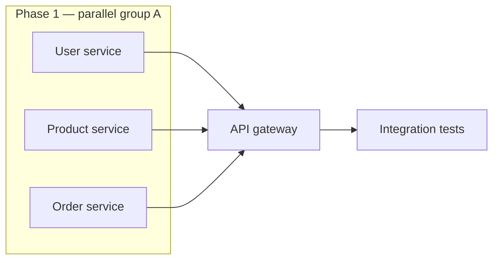
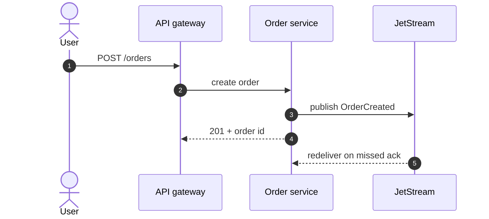
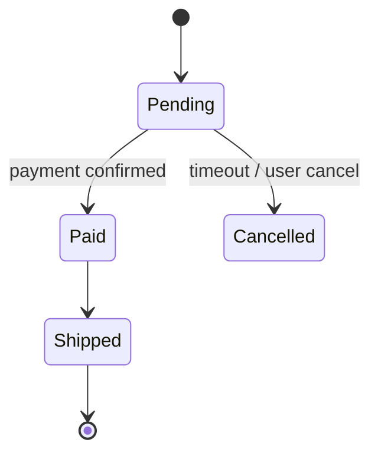
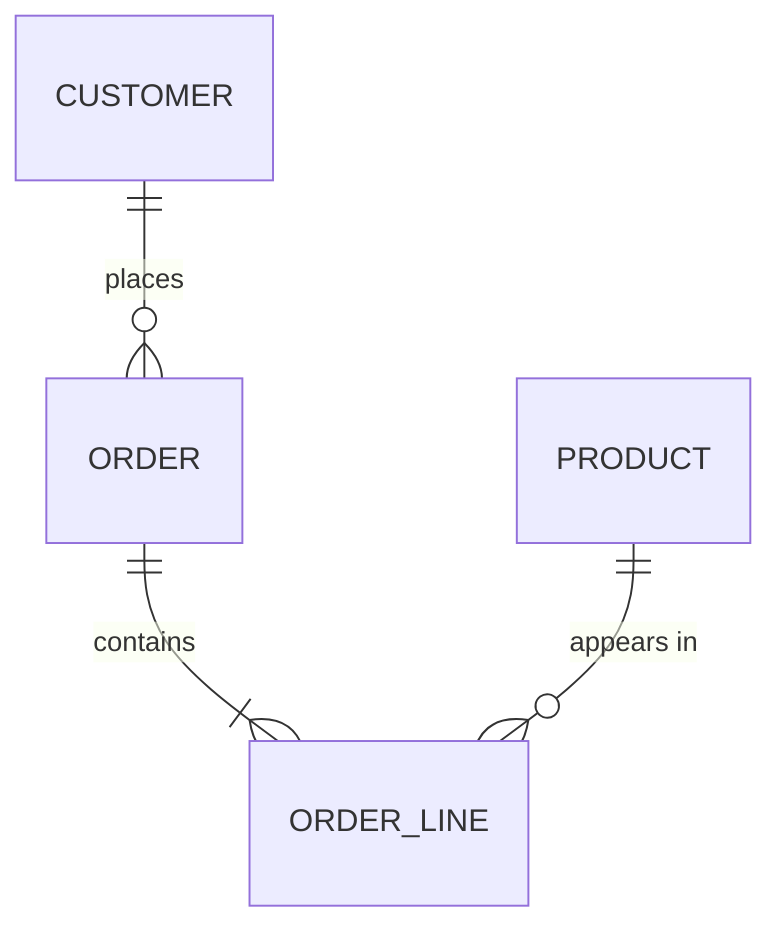
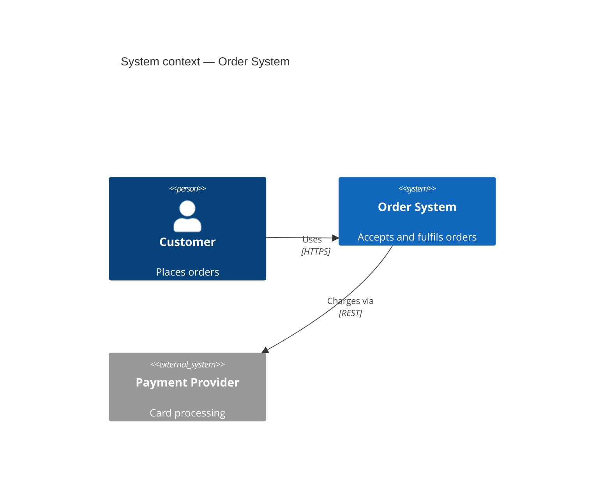
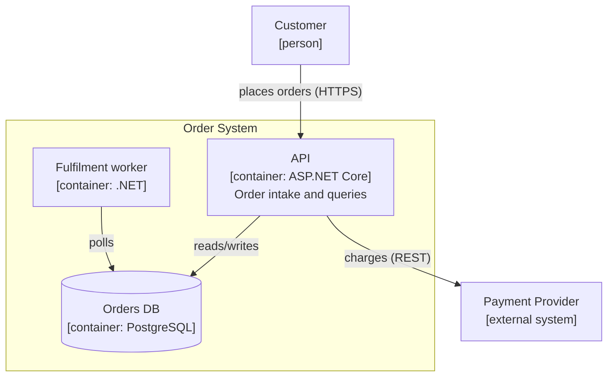

# Diagramming with Mermaid: patterns per intent

Mermaid (current version per `knowledge/shared/versions.md`) renders text-defined diagrams
natively on GitHub, GitLab, and
most doc generators, which makes it the default diagram tool for repo documentation: diagrams
live in markdown, diff in PRs, and never become stale binary attachments. Start from what the
reader must understand — the intent — and pick the diagram type from that.

## Intent → diagram type

| Reader must understand | Diagram type | Mermaid keyword | Notes |
|---|---|---|---|
| Static structure, dependencies, data/control flow | Flowchart | `flowchart` | The workhorse; also the pragmatic C4 fallback (below) |
| Who calls whom, in what order, for one scenario | Sequence | `sequenceDiagram` | Best for runtime views (arc42 §6) and API interactions |
| States and transitions of one thing over its life | State | `stateDiagram-v2` | Order status, connection lifecycle, job states |
| Entities and their relationships | ER | `erDiagram` | Schema-level, not per-column detail |
| Domain model, class relationships | Class | `classDiagram` | Use sparingly; code-level diagrams rot fastest |
| System context/containers, C4-style | C4 | `C4Context` etc. | Experimental in Mermaid — see C4 section below |
| Services on infrastructure, deployment topology | Architecture | `architecture-beta` | Beta (v11.1+); icon support; GitHub rendering may lag |
| Phases, tasks, durations over calendar time | Gantt | `gantt` | Plans and timelines; keep coarse |
| Branching/merge strategy | Git graph | `gitGraph` | Explaining workflow conventions |
| Hierarchical breakdown of a topic | Mindmap | `mindmap` | Brainstorm-shaped content; rarely load-bearing |
| Ordered milestones | Timeline | `timeline` | Roadmaps, history sections |
| Requirements and traceability | Requirement | `requirementDiagram` | Niche; tables usually beat it |

Stable types render everywhere GitHub does; beta types (`architecture-beta`, `block`, `xychart`,
`sankey`, `kanban`, `packet`, and others) may not render on github.com yet — verify before
committing docs that depend on them, and prefer a stable type when the diagram must render in
PR review.

## Patterns

Dependency graph for an implementation plan (phases, parallel groups, critical path):

Runtime scenario (arc42 §6, one risky interaction, numbered by the renderer):

Lifecycle (state diagram):

Data model (ER, schema level):

## C4 diagrams in Mermaid

Mermaid has native C4 syntax (`C4Context`, `C4Container`, `C4Component`, `C4Dynamic`,
`C4Deployment`), but it has been marked experimental for years: layout control is limited and
syntax may change. Two working approaches:

1. Native syntax — fine for small context diagrams that GitHub must render:

2. Styled flowchart as C4 — the pragmatic default for container diagrams, using C4's
   discipline (name, type, description on every element; labeled relationships) with
   flowchart's reliable layout:

Whichever you use, keep C4's rules: state the level and scope in the title, describe every
element, label every arrow, add a legend when notation isn't obvious.

## Readability rules

- One message per diagram. If it needs a paragraph to explain, split it or delete it.
- Under ~20 nodes; zoom (separate diagrams) instead of cramming.
- Choose direction for the story: `LR` for pipelines and dependency chains, `TB` for
  hierarchies and layered structure.
- Label edges with verbs ("publishes", "reads") — an unlabeled arrow is a question mark.
- Quote labels containing spaces or punctuation: `A["Order service (v2)"]`.
- Add accessibility fields for docs sites: `accTitle:` and `accDescr:` lines after the diagram
  keyword.
- Every diagram in a doc gets a lead-in sentence saying what to look at; a diagram that merely
  restates the adjacent list should be deleted.

## Verifying diagrams render

A broken diagram is a broken page, so rendering is part of doc QA:

- CLI: `npx -y @mermaid-js/mermaid-cli mmdc -i page.md` renders and fails on syntax errors
  (use `-i diagram.mmd -o out.svg` for single diagrams).
- No CLI available: paste into mermaid.live and confirm it renders without errors.
- GitHub-targeted docs: check the rendered file view for each changed diagram type at least
  once — github.com's bundled Mermaid version can trail the release, so recently added
  syntax may fail there while working in mermaid.live.
- Common syntax traps: unquoted labels with `(){}[]` characters, `end` as a bare node name in
  flowcharts, missing `participant` declarations when aliasing in sequence diagrams, and
  comments (`%%`) accidentally placed inside multi-line strings.

Sources: mermaid.js.org (diagram list and syntax; C4 marked experimental; architecture-beta
v11.1+; current version in `knowledge/shared/versions.md`), github.com docs on Mermaid
rendering support.
