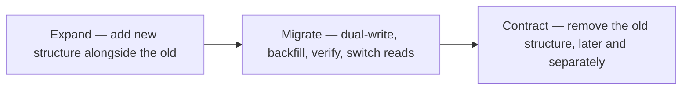

# Data and schema migration safety — Expand-contract

Section of `knowledge/quality/data-migration-safety.md`.

The pattern that removes downtime and most of the risk from schema change: never alter or
remove structure the running system depends on in the same step that introduces its
replacement.

Rules that make it work:

- Additive first. New columns, tables, and indexes ship before any code depends on them, and
  coexist with the old structure. Renames and type changes are never in-place: add the new
  column, migrate, drop the old one — a rename is an expand-contract sequence wearing a
  disguise.
- One phase per deploy. Expand, each migrate step (enable dual-write, backfill, switch
  reads), and contract are separate releases with an observation period between them. A
  single deploy that adds, migrates, and drops has no intermediate state to roll back to.
- Compatible with every running version. During a rolling deploy — and after a rollback — old
  and new application code run concurrently against the same schema. Every schema state in
  the sequence must satisfy both the current and the previous application version; that is
  the same N and N-1 compatibility that release rollback depends on
  (`knowledge/quality/release-readiness.md#rollback`).
- Dual-write before switching reads. While both structures exist, writes go to both (in the
  application or via the migration tool's triggers/views); reads move only after the backfill
  is verified. Only when nothing reads the old structure — confirmed by observation, not
  assumption — does the contract phase drop it.
- Destructive steps ship separately and late. Drops, renames-completions, and type
  narrowings ride their own change, after the observation period, with the full sequence
  stated in the handoff so the gate can see that the destructive step is the tail of a
  completed expansion, not a shortcut.

Migration tooling (versioned migration frameworks, and zero-downtime tools that automate
dual-write and versioned schema views) changes the mechanics, not the policy: whatever the
repo standardizes on, the sequence above is what the gate checks for.
