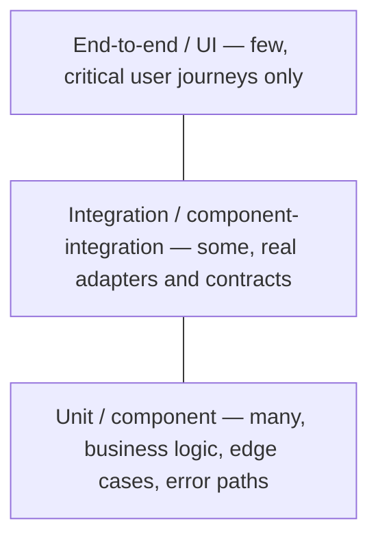

# Test strategy — The test pyramid

Section of `knowledge/quality/test-strategy.md`.

Distribution of tests by level — many fast isolated tests at the bottom, few slow end-to-end
tests at the top. The pyramid is an economics statement: cost per test (write, run, diagnose,
maintain) rises with the level, so push every check to the lowest level that can catch it.

Smells that the pyramid is inverted: logic bugs found only by E2E runs; unit suites that mock so
much they test the mocks; integration suites re-testing every branch already covered below. A
bug caught at the wrong level is a signal to add the missing lower-level test with the fix, not
just to fix the code.
