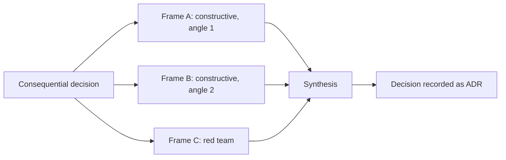

# Three-framing analysis: parallel exploration of consequential decisions

When a structural decision is too consequential to trust to a single pass, explore it three
ways in parallel, then synthesize. A single analysis — however careful — anchors on its first
plausible framing and spends the rest of its effort defending it. Three genuinely different
framings, two constructive and one adversarial, map the option space and surface the failure
modes before the decision hardens. The pattern is lens-agnostic: it applies equally to
architecture, security design, quality strategy, and product or project structural calls.

## When to run it

Run three framings when the decision is a one-way door: reversing it later would be expensive,
and its blast radius extends beyond one module or one team's sprint. Any of these triggers:

- Architecture and module-boundary choices — service decomposition, data ownership, protocol
  and contract shape, framework or platform selection.
- Security-critical designs — trust boundaries, authentication and authorization models,
  secret handling, anything whose failure is an incident rather than a bug.
- Cross-cutting or migration decisions — changes that touch many components at once, or
  sequences with irreversible steps (data migrations, cutover strategies, deprecations).
- Load-bearing technical assumptions — an unverified belief the whole design rests on
  ("the queue preserves ordering", "the tenant count stays below N", "the vendor API is stable").

Explicit non-triggers — do not add this ceremony to:

- Reversible decisions: cheap to change later, contained inside one module.
- Low-stakes decisions: whichever option is chosen, the cost of being wrong is small.
- Well-precedented decisions: an accepted ADR, platform reference architecture, or oracle
  entry already settles the question — follow the precedent or supersede it, don't re-derive it.

The bar sits above the ADR significance bar in `knowledge/architecture/adr-practice.md`: every
three-framing decision produces an ADR, but most ADR-worthy decisions need only the ordinary
single-pass option comparison. Three framings are for the subset where being wrong is both
likely enough (genuine uncertainty) and expensive enough (hard reversal) to justify triple work.

## The three framings

The framings run in parallel and must be genuinely different — different premises, not the same
analysis in three voices. If two framings recommend the same option for the same reasons, one of
them is a restatement: re-angle it before synthesizing.

### Frames A and B: constructive, from deliberately different angles

Both build a real, complete recommendation, but each starts from a different priority,
architectural style, or constraint set. Pick an angle-pair whose tension matches the decision:

| Axis | Frame A angle | Frame B angle |
|---|---|---|
| Quality-attribute priority | Availability-first: degrade gracefully, tolerate staleness | Integrity-first: fail closed, enforce strong invariants |
| Architectural style | Modular monolith, optimized for team cognitive load | Decomposed services, optimized for independent deployment |
| Constraint set | Brownfield-minimal: smallest change meeting the scenarios | Greenfield-target: design as if legacy constraints were gone |
| Sourcing | Build on existing in-house/platform primitives | Adopt off-the-shelf or managed offerings and integrate |
| Time horizon | Optimize for the team and load of the next two quarters | Optimize for the system at several times today's scale |
| Security posture | Usability-first with compensating controls | Least-privilege-first, accepting workflow friction |
| Product/project shape | Sequence for earliest user-visible value | Sequence for earliest risk retirement |

Each constructive frame must be able to win. A frame constructed to lose — a straw man propping
up a favorite — defeats the purpose; if one angle is obviously untenable for this decision,
choose a different pair.

### Frame C: the red team

Frame C does not propose. It attacks the option currently leading — the proposal that prompted
the decision, the incumbent design, or, when nothing leads yet, the option the requester is
leaning toward — and tries to make the decision wrong:

- Enumerate the assumptions the leading option rests on; flag every one that is load-bearing
  and unverified, and say what evidence would verify or break it.
- Hunt failure modes: how the option behaves when every estimate takes its pessimistic value,
  under partial failure, under adversarial input, at the edges of scale.
- Find the irreversible steps and ask what is known at each point of no return.
- Ask who or what exploits the design — a security attacker, a misaligned incentive, an
  integration partner behaving badly.
- Name the conditions under which a rejected alternative would have been the right call.

Frame C is first-class, never a rubber stamp: it gets the same effort budget as A and B, and its
findings are itemized in the synthesis. A Frame C that returns "no significant concerns" on a
one-way-door decision signals a shallow pass — rerun it with a sharper attack surface, not a
shrug.

## Synthesis

One synthesizer reconciles the three results against the decision's stated goals or quality
scenarios — not by vote; three framings are perspectives, not ballots.

1. Where the framings agree, the conclusion is robust — record it as settled.
2. Where they disagree, the disagreement is the real trade-off. Name the sensitivity point:
   which assumption or priority, if flipped, flips the choice.
3. Weigh Frame C's attacks against each candidate, not only the leader. Choose.
4. Record the decision as a MADR ADR (`knowledge/architecture/adr-practice.md`): the framings'
   candidates become the considered options, and the record states why the losing options lost.
5. Capture what Frame C surfaced even when the leading option still wins — as "Bad, because"
   consequences, as confirmation checks that will detect the feared failure early, or as
   residual risks with mitigations. Discarding the red team's findings because "we chose it
   anyway" throws away the most expensive part of the analysis.
6. If Frame C exposed a load-bearing assumption that can only be settled by running code, add a
   time-boxed spike to the plan before the decision is treated as final.

## How an agent runs it

Prefer parallel sub-analyses. Spawn three sub-agents in one batch, each with the same decision
context and inputs but its own framing brief: Frame A's angle, Frame B's angle, and an
explicitly adversarial mandate for Frame C. Parallel runs cannot anchor on each other, which is
the point. Each sub-analysis returns a condensed conclusion — recommended option (or, for Frame
C, itemized attacks), key evidence, and what the recommendation sacrifices — not a transcript.

When parallel spawning isn't available, run three explicit sequential passes with the third
adversarial. Write all three framing briefs before starting the first pass, and close each pass
with a written conclusion before opening the next, so later passes argue their own premise
instead of quietly absorbing the earlier ones. Sequential Frame C attacks whichever option leads
after passes A and B.

In both modes the red-team pass keeps full standing: it runs even when A and B agree, its budget
is not cut to save time, and the synthesis quotes its findings rather than summarizing them
away.

## Anti-patterns

| Anti-pattern | Why it hurts | Instead |
|---|---|---|
| One favorite plus two straw men | The "analysis" is a justification with props | Pick an angle-pair where both constructive frames can win |
| Frame C as rubber stamp | The riskiest assumptions ship unexamined | Same budget as A/B; itemized attacks; rerun shallow passes |
| Three restatements | Triple cost, single perspective | Different premises per frame; re-angle overlapping frames |
| Running it on every choice | Ceremony erodes the signal; delivery slows | Honor the non-triggers; default to single-pass analysis |
| Synthesis by majority vote | Perspectives aren't ballots; C never "wins" a vote | Reconcile against goals/quality scenarios; name sensitivity points |
| Dropping Frame C's findings after deciding | The failure modes recur, now unrecorded | Record them in the ADR as consequences, checks, or risks |
| No written record | The decision gets relitigated or reversed blind | One ADR per decision, framings as considered options |
